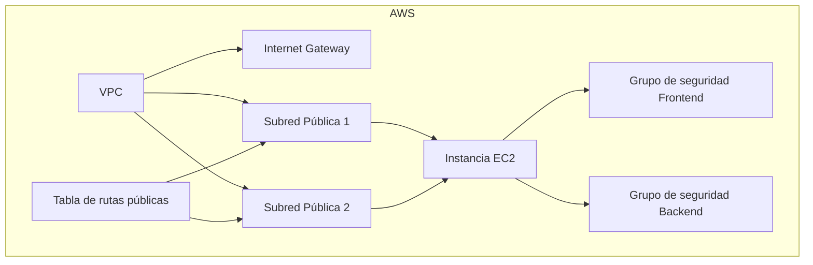

# LuxuryWear deployment en AWS EC2 con Terraform

Este proyecto de Terraform aprovisiona una instancia de Amazon EC2 que ejecuta Amazon Linux. La instancia está configurada para alojar la aplicación de _LuxuryWear_ dentro de un contenedor Docker, con puertos abiertos para SSH (22), el frontend (3000) y el backend (8080). La infraestructura está completamente automatizada utilizando Terraform y está diseñada para desplegarse fácilmente.

---

## Resumen del Proyecto

### Propósito

El objetivo de este proyecto es desplegar una instancia EC2 en AWS con una configuración segura y escalable, permitiendo que la aplicación de _LuxuryWear_ se ejecute sin problemas dentro de un entorno Docker. Este entorno facilita el despliegue y la gestión rápida de la aplicación en la nube.

### Estructura del Proyecto

```plaintext
deployment-terraform/
├── main.tf                # Configuración principal de Terraform
├── variables.tf           # Definiciones de variables globales
├── terraform.tfvars       # Variables definidas por el usuario
├── outputs.tf             # Definiciones de salidas
├── modules/
│   ├── networking/        # Recursos relacionados con redes (VPC, subnets, rutas)
│   │   ├── main.tf
│   │   ├── variables.tf
│   │   ├── outputs.tf
│   ├── ec2/               # Configuración de la instancia EC2
│   │   ├── main.tf
│   │   ├── variables.tf
│   │   ├── outputs.tf
│   └── security_groups/   # Configuración de grupos de seguridad
│       ├── main.tf
│       ├── variables.tf
│       ├── outputs.tf
```

Cada módulo representa un agrupamiento lógico de recursos:
- **Módulo de Red**: Aprovisiona la VPC, subnets y el ruteo.
- **Módulo de Grupos de Seguridad**: Configura los grupos de seguridad para controlar el tráfico.
- **Módulo de EC2**: Despliega y configura la instancia EC2.

---

## Resumen de Recursos en AWS

### Diagrama de Recursos en AWS

A continuación, se presenta una representación visual de la infraestructura creada por este proyecto de Terraform.



---

## Guía de Ejecución

### Requisitos Previos

1. **Cuenta de AWS**: Asegúrate de tener una cuenta activa de AWS.
2. **Configuración de AWS CLI**:
   - Instala y configura el AWS CLI en tu máquina.
   - Configura un perfil predeterminado de AWS CLI con las credenciales necesarias.
3. **Terraform**:
   - Instala Terraform en tu máquina local. Sigue la [guía oficial de instalación de Terraform](https://developer.hashicorp.com/terraform/tutorials/aws-get-started/install-cli).

### Pasos para el Despliegue

1. **Clona el Repositorio**:
   - Clona este repositorio en tu máquina local.

2. **Configura `terraform.tfvars`**:
   - Crea un archivo `terraform.tfvars` en la raíz del proyecto con el siguiente contenido:
     ```hcl
     key_name = "tuNombreDeClave"
     ```
     Reemplaza `tuNombreDeClave` con el nombre de tu par de claves de AWS.

3. **Inicializa Terraform**:
   - Navega a la raíz del proyecto y ejecuta:
     ```bash
     terraform init
     ```

4. **Planifica la Infraestructura**:
   - Revisa los recursos planeados:
     ```bash
     terraform plan
     ```

5. **Aplica la Configuración**:
   - Despliega la infraestructura:
     ```bash
     terraform apply
     ```

6. **Revisa las Salidas de Terraform**:
   - Una vez completado el despliegue, toma nota de las salidas:
      - `frontend_url`: URL para acceder a la aplicación desplegada.
      - `connect_instance`: Comando para conectarte a la instancia EC2 mediante SSH.

---

### Explicación de las Salidas

1. **`frontend_url`**:
   - Proporciona la URL para acceder a la aplicación.
   - Ejemplo:
     ```bash
     frontend_url = "http://ec2-18-207-107-161.compute-1.amazonaws.com:3000"
     ```
   - **Nota**: Puede tomar algunos minutos para que la aplicación se inicialice completamente (8 minutos o menos).

2. **`connect_instance`**:
   - Comando para conectarte a la instancia EC2 mediante SSH.
   - Ejemplo:
     ```bash
     connect_instance = "ssh -i tuNombreDeClave ec2-user@ec2-18-207-107-161.compute-1.amazonaws.com"
     ```
   - Reemplaza `tuNombreDeClave` con la ruta completa a tu clave privada de SSH.

---

### Solución de Problemas

- Asegúrate de que AWS CLI esté configurado correctamente con los permisos necesarios.
- Verifica que el `key_name` especificado en `terraform.tfvars` coincida con un par de claves existente en AWS.
- Comprueba que el estado de la instancia EC2 sea `running` en la consola de administración de AWS.

---

### Limpieza

Para destruir la infraestructura creada y evitar cargos, ejecuta:
```bash
terraform destroy
```